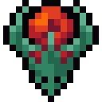

# DUNGEON CLICKER 
<p align="center">
  
</p>

## Requirements 
 - Java Version 1.8
 - IntelliJ
 - Gradlew 
## Run game 
```
git clone https://github.com/Delapee/deustoClicker.git

Running: 
- Right click your DesktopLauncher class
- Select 'Run DesktopLauncher.main()'
      This should fail with missing assets, we need to hook up the assets folder
- Open up Run Configurations
- Edit the Run Configuration that was just created by running the desktop project and set the working directory to point to your core/assets folder.
- Run your application using the run button
```